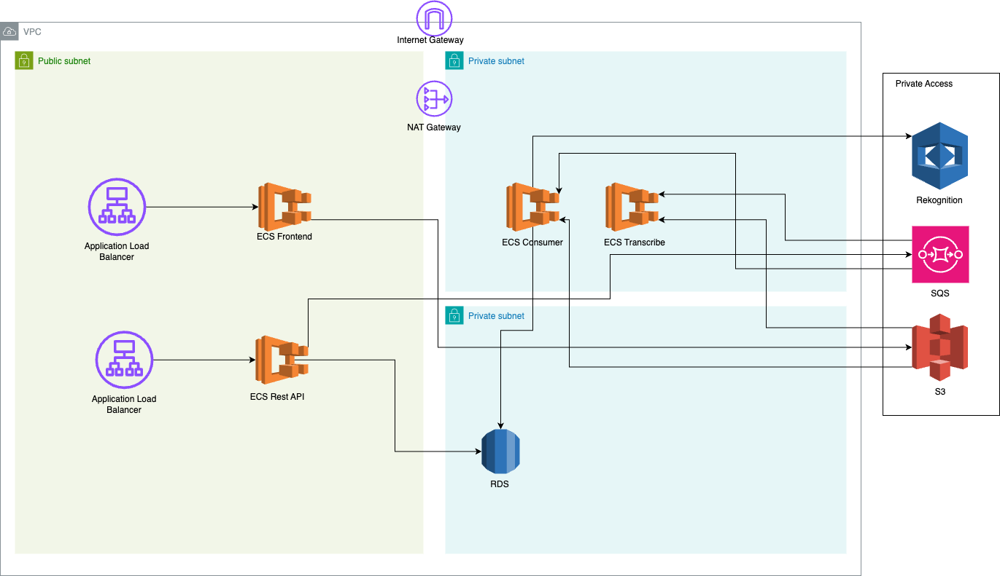

## Quiz Master

- A quiz platform enabling professors to manage quizzes, including video analysis of students for cheating detection and transcription, along with the automated assessment of answers.

## Features

1. Course Management:
    - Professors can create and manage courses within the platform.
    - They can invite students to join courses using their email addresses.
2. Quiz Management:
    - Professors can create quizzes within courses, with options for different types such as Recording or Typing.
    - They can provide questions for each quiz and view the results submitted by students.
3.	Student Interaction:
    - Students can access courses available on the platform.
    - They can participate in quizzes during specified timeframes.
4.	Quiz Taking:
    - For Recording quizzes, students are prompted to speak answers while the system records their video responses for cheating detection and answer accuracy assessment.
    - For Typing quizzes, students type their answers while the system records their actions for cheating detection and assesses answer accuracy directly.
5.	Score Viewing:
    - Students can view their scores achieved in quizzes.

## Architecture

## AWS Cloud Services

- AWS CloudFormation
- Elastic Container Service (ECS)
- EC2
- Relational Database Service (RDS)
- S3
- Virtual Private Cloud (VPC)
- Elastic Load Balancing (ELB)
- Simple Queue Service (SQS)
- Amazon Rekognition

## Languages/Frameworks/Technologies

- .NET Core (C#)
- React.js
- Python
- ChatGPT-3.5 API